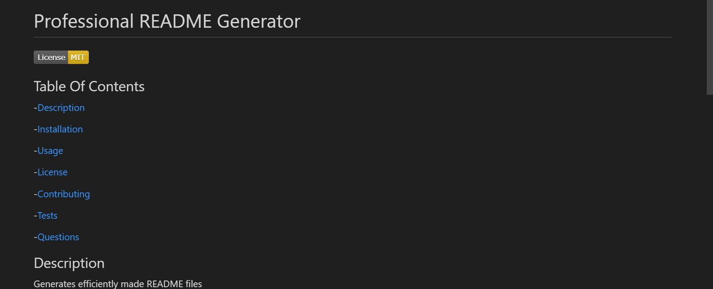

# Professional README Generator

## Description 

- Creates a series of prompts that when answered, generates a new README file. 

 
 

## Contributors 

- Mark Martinez

 
 

## Screenshot of the finished generated README file
 

 
 

## Designs for the future

Implement a way to add screenshots.

 
 

## GitHub Respository Link 

[GitHub Link](https://github.com/MarkAnthony9014/professional-readme-generator)

